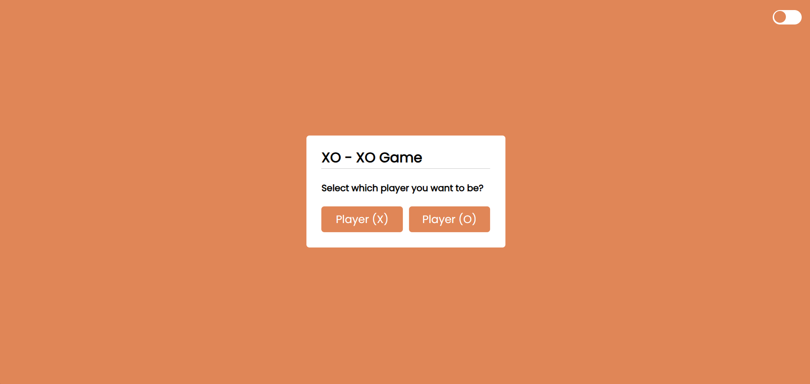

# XOXO Game

XOXO Game is a modern take on the classic Tic-Tac-Toe game, designed to provide a fun and interactive gaming experience. Developed with HTML, CSS, JavaScript, and Bootstrap, this game features a sleek user interface that is responsive and accessible on various devices.

## Features

- **Interactive Play**: Enjoy playing against a friend or challenge yourself against the computer.
- **Responsive Design**: Built with Bootstrap, the game's layout adjusts to fit mobile phones, tablets, and desktop screens.
- **Score Tracking**: Keep track of wins, losses, and ties with an integrated score system.
- **Game Reset**: Easily start a new game or reset scores with the click of a button.

## Getting Started

To play the XOXO Game, simply clone this repository to your local machine and open the `index.html` file in your web browser.

## How to Play

The game is simple yet engaging, played on a 3x3 grid.

- The grid is made up of 3 squares by 3 squares.
- Two players take turns to mark their chosen squares with either an 'O' or 'X'.
- The goal is to be the first player to align three of their marks vertically, horizontally, or diagonally.
- Should all 9 squares be filled without any player achieving this alignment, the game is declared a tie.

Immerse yourself in this strategic game that tests your foresight and tactics, perfect for all ages!

## Built With

- **HTML5**: Utilized for the structural foundation of the game interface, ensuring content is well organized.
- **CSS3**: Employs advanced styling features to enhance the visual appeal and user experience of the game.
- **JavaScript**: Adds interactivity to the game, enabling dynamic content manipulation for a lively gaming experience.
- **Bootstrap**: Provides a responsive framework, making the game accessible on a wide range of devices from mobile phones to desktop computers.
